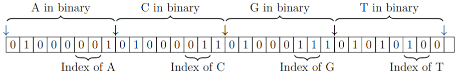

```{r setup, echo=F, message=F, warning=F, cache=F}
library('scales')
library('tidyverse')

data <- read.csv("cal.csv") %>%
  mutate(pext=as.logical(pext),
         async=as.logical(async),
         unordered=as.logical(unordered),
         skip_io=as.logical(skip_io),
         encoding_bw=encoding_bw / 1e6, # Convert to MBase/sec
         decoding_bw=decoding_bw * 4 / 1e6   # Convert bytes/sec to MBases/sec
         )

inpsize <- 3*2^30
chunksize <- 2^17
asyncsize <- 2^23
enc_col <- 'purple' #'#00CCCC'
dec_col <- 'green' #'#000066'

baseline <- filter(data, experiment == "Baseline", input_size != inpsize)
io <- filter(data, experiment %in% c("Chunked I/O", "Asynchronous I/O"), chunk_sz <= 2^30)
multi <- filter(data, experiment %in% c("Multithreading"), chunk_sz==chunksize)
noIO <- filter(data, experiment %in% c("No I/O"))
chunked <- filter(data, experiment %in% c("memory chunked"), chunk_sz <= 2^28)
unordered <- filter(data, experiment %in% c("Unordered"), chunk_sz < 2^30)
unroll <- filter(data, experiment %in% c("Unroll2"), chunk_sz < 2^30)
```


# Introduction


The size of sequenced genomic data doubles roughly every 18 months, and has already grown to petabyte-scale [@mansouri20:lossless].
Storing and manipulating these sequences, which can be several gigabytes long for whole genomes, requires significant storage and computing resources [@gilmary21:compression].
Moreover, Next-generation sequencing (NGS) techniques produce millions of short reads, which are amenable to compression algorithms that exploit the redundancies in longer sequences [@zhu13:throughput].
Dozens of lossless compression techniques have been proposed for DNA sequences, with varying tradeoffs between compression ratios, encoding and decoding speed, and memory consumption [@pratas19:reference].
These tradeoffs matter because in many applications, throughput and ease-of-processing of the encoded stream are critical [@ouyang12:fast].

When time and memory constraints are the top priorities for a DNA encoder, there is an encoding technique that simply maps each of the four possible base letters ('A', 'C', 'G', or 'T') to a unique 2-bit sequence.
This encoding is not a compression method per se, even though the trivial 4:1 size reduction it achieves from ASCII files is not far from that achieved with more sophisticated approaches.
Standard substitution-based (e.g., Lempel-Ziv) and entropy-based (e.g., Huffman) encoding methods rarely accomplish significantly better compression ratios than the two-bits-per-pair of direct coding [@cox12:bwt].
More specialized DNA-specific approaches often achieve better size reduction either at the cost of significant computation resources or by referring to a baseline genome that brings its own limitations and disadvantages [@gilmary21:compression].

In this paper, we explore the idea of storing raw DNA sequences using a bijective mapping to two bits per symbol, which is particularly useful when extremely fast compression, decompression, access, or search is necessary; when random access to any base in the encoded stream is desired; or when combined with specialized compression techniques. 
Existing implementations of this encoding tend to be naive and highly serialized [@mehta10:hash; @priyanka14:ascii].
Here, we revisit this encoding with a novel implementation that emphasizes multilevel parallelism that can encode  DNA at speeds near the underlying hardware's bandwidth with nominal memory consumption.


<!----------------------------------------->

# Evaluation {#sec:implementation}


Our C++ implementation was evaluated on a desktop machine running Linux v. 6.2.0-32 and gcc v. 13.1.0, using a 16-core AMD 5950X CPU, 128 GiB of DDR4-3200 RAM, and Samsung 980 PRO 2TB SSD for primary storage.^[Source code and experiments are available at [github.com/eitanf/fastdna](https://github.com/eitanf/fastdna).]
All experiments were run `r repeats <- 100; repeats` times to observe their variability, and were preceded with a Linux buffer (page cache) flush to ensure I/O cost is included in the measured run time.

Direct-coding takes the exact same code paths regardless of the input, so encoding and decoding time does not depend on the actual bases in the input.
We can therefore generate input of arbitrary size with a random selection of bases.
Further, to compare the encoder and decoder on equal terms, we measure throughput in millions of input bases per second (MBase/s) instead of MB/s, since the decoder's input file is a quarter of the size of the encoder's in bytes.
With these preliminaries, we can now evaluate the performance implications of different levels of software and hardware parallelism mechanisms.

<!------>

## Baseline sequential version

As a basis for comparison, we start with a straightforward sequential implementation of the encoder and decoder using lookup tables (LUT).
The encoder's loop looks similar to this:

\footnotesize
```
// Encode every 4 bases into one byte
// BMAP maps from 'A','C','G','T' to 0,1,3,2
void encode(char* in, size_t size, char* out) {
  for (i = 0; i < size; i += 4) {
    *out   = BMAP[*in++];
    *out   = BMAP[*in++] | (*out << 2);
    *out   = BMAP[*in++] | (*out << 2);
    *out++ = BMAP[*in++] | (*out << 2);
  }
}
```
\normalsize
The baseline decoder uses a similar loop that maps each byte of input into four bytes (bases) of output, again using a 256-entry compile-time LUT.
Any leftover bases beyond the largest multiple of 4 are handled as a special case.

Even this simple version of direct encoding compiles to efficient machine code and runs significantly faster than typical compressing DNA encoders [@kryukov20:sequence], with a maximum encoding throughput of over 500 MBase/s (Figure \@ref(fig:naive-throughput)).
<!--Decoding is generally faster than encoding, likely because it only requires one table lookup for every four bases.-->


```{r naive-throughput, echo=F, warning=F, message=F, cache=F, fig.height=4, out.width="100%", fig.cap="Distribution boxplot of 100 runs of the encoder and decoder across increqasing input sizes (log-log scale)"}
all_sizes <- filter(baseline, copy == 1)$input_size

baseline %>%
  rename("Encoding"="encoding_bw", "Decoding"="decoding_bw") %>%
  pivot_longer(cols=c("Encoding", "Decoding"), names_to="Operation", values_to="Throughput") %>%
  mutate(Operation=factor(Operation, levels=c("Encoding", "Decoding"))) %>%
  ggplot(aes(x=input_size, y=Throughput, group=interaction(input_size, Operation), color=Operation)) +
    geom_boxplot(alpha=1, outlier.size=1, notch=F) +
    scale_y_log10("Throughput (MBase/s)",
#                  limits=c(5*10^5, 2*10^9),
                  breaks=c(1, 5, 10, 25, 50, 100, 250, 500)) + #trans_breaks("log10", function(x) 10^x),
#                  labels=trans_format("log10", math_format(10^.x))) +
    scale_x_continuous("Input size",
                       trans="log2",
                       breaks=all_sizes,
                       labels=number_bytes_format(units="binary")) +
    scale_color_manual(limits=c("Encoding", "Decoding"), values=c(enc_col, dec_col)) +
    theme_minimal() +
    theme(axis.text.x=element_text(angle=45, size=8),
          legend.position="bottom",
          panel.grid.minor=element_blank())
```


Most distributions are narrowly centered around the median.
Larger input sizes amortize the overhead of file I/O and setup/teardown, so they reflect better the performance potential of the algorithm.
Larger files also hide better the deleterious effects of system-level delays (noise).
These slower runs can produce outlier points, reflecting transient effects in the system such as context switches and I/O interference.
But their effect is only noticeable for small inputs (up to a few KiB), where their relative magnitude is comparable to the overall run time.
As the input size grows, the effect of the noise grows negligible.
By the time input size reaches 1 GiB, throughput has largely converged and the standard deviation of the run time falls below 1% of the mean run time.
We will therefore use an input size of 3 GiB (full human genome size [@cox12:bwt]) for the remainder of the evaluation, for which this baseline implementation yields a median encoding throughput of
`r base_enc <- median(filter(data, experiment == "Baseline", input_size == inpsize)$encoding_bw); round(base_enc)`
MBase/s and median decoding throughput of
`r base_dec <- median(filter(data, experiment == "Baseline", input_size == inpsize)$decoding_bw); round(base_dec)`
MBase/s.


<!------>

## Device-level parallelism

The encoding and decoding work takes place on the CPU while the I/O takes place on a separate physical device, the SSD.
In the baseline implementation, these phases happen at separate times, which means that while one device is busy, the other is idle.
We can overlap the writing of outputs to disk with computation if we divide the computation into chunks of the input, and issue writes to each chunk of output while starting to compute on the next chunk.
The best chunk size to maximize this overlap depends on the relative speeds of the computation and I/O, so we measured the throughput for multiple chunk sizes.
As Figure \@ref(fig:chunked-io) shows, synchronous encoding and decoding on this platform is fastest at a chunk size of 128 KiB, with a median encoding throughput of
`r chunk_enc <- median(filter(data, experiment == "Chunked I/O", chunk_sz == chunksize)$encoding_bw); round(chunk_enc)`
 MBase/s (`r round(100*chunk_enc/base_enc - 100, 1)`% improvement over Baseline), and a median decoding throughput of
`r chunk_dec <- median(filter(data, experiment == "Chunked I/O", chunk_sz == chunksize)$decoding_bw); round(chunk_dec)`
MBase/s (`r round(100*chunk_dec/base_dec - 100, 1)`% improvement).


```{r chunked-io, echo=F, warning=F, message=F, cache=F, fig.height=3.5, out.width="100%", fig.cap="Median throughput vs.  I/O chunk size with both synchronous and asynchrnous I/O (100 runs; 3 GiB input; 95\\% CI; logarithmic x-axis)"}
all_sizes <- filter(io, copy == 1)$chunk_sz

io %>%
  rename("encode"="encoding_bw", "decode"="decoding_bw") %>%
  pivot_longer(cols=c("encode", "decode"), names_to="Operation", values_to="Throughput") %>%
  mutate(Op=factor(Operation, levels=c("encode", "decode"))) %>%
  mutate(Operation=paste(ifelse(experiment == "Chunked I/O", "Sync", "Async"), Op)) %>%
  mutate(Operation=factor(Operation, levels=c("Sync encode", "Sync decode", "Async encode", "Async decode"))) %>%
  group_by(Operation, chunk_sz) %>%
  summarize(med=median(Throughput), mn=mean(Throughput), low=mn - 1.96*sd(Throughput), high=mn + 1.96*sd(Throughput)) %>%
  ggplot(aes(x=chunk_sz, y=med, fill=Operation, color=Operation)) + #, group=interaction(chunk_sz, Operation))) +
    geom_pointrange(aes(ymin=low, ymax=high), size=0.3, position=position_dodge(width=0.3)) +
#    geom_pointrange(aes(ymin=low, ymax=high), position=position_dodge(width=0.9)) +
#    geom_point(aes(color=Operation), size=2, alpha=0.5) +
#    geom_col(position=position_dodge()) +
#    geom_errorbar(aes(ymin=low, ymax=high), alpha=0.5, width=0.5, position=position_dodge(width=0.9)) +
#    geom_line() +
#    geom_boxplot(alpha=1, outlier.size=1, notch=T) +
    ylab("Throughput Mbase/s)") +
    scale_x_continuous("Chunk size",
                       trans="log2",
                       breaks=all_sizes,
                       labels=number_bytes_format(units="binary")) +
#    scale_fill_manual(limits=c("Encoding", "Decoding"), values=c(enc_col, dec_col)) +
#    scale_color_manual(limits=c("Encoding", "Decoding"), values=c(enc_col, dec_col)) +
    scale_color_manual(values=c("aquamarine", "darkgreen", "brown", "orange")) +
    theme_minimal() +
    theme(axis.text.x=element_text(angle=45, size=7),
          legend.position="bottom",
          panel.grid.minor.x=element_blank())
```

The overlapping can be extended to reads as well as writes by using the POSIX asynchronous I/O (AIO) library.
This library maintains a thread pool to execute I/O requests asynchronously [@lahaise02:aio].
By carefully orchestrating an active and standby buffer for reads, and another pair for writes, we can rewrite the code so that a previous chunk is written and a future chunk is read while a current chunk is being encoded or decoded.
As the results in Figure \@ref(fig:chunked-io) show, the effort is worthwhile.
For example, at a chunk size of 32 MiB, the median encoding bandwidth increases to
`r async_enc <- median(filter(data, experiment == "Asynchronous I/O", chunk_sz == asyncsize)$encoding_bw); round(async_enc)`
 MBase/s (`r round(100*async_enc/chunk_enc - 100, 1)`% improvement over chunked I/O).

For larger buffer sizes, results grow noisier and require larger input sizes to benefit from this approach.
These limits to generality motivate our next approach, namely, multithreading.

<!------>

## Thread-level parallelism

To address the limitations of asynchronous I/O, we turn to multithreading to exploit parallelism both in the CPU and the SSD.
Note that multithreading obviates the need to use AIO, because we already reached maximum SSD throughput, so we reuse the simple chunked-I/O implementation with a chunk size of 128 MiB.
Our implementation splits the input and output roughly equally among the desired number of threads, and each thread encodes/decodes in its own memory buffers.

The threads use no locks and share no data or resources other than the input and output files, which they each address at independent offsets.
One would expect near-perfect scalability of such a model, but in reality, the single shared resource, disk I/O, quickly becomes a contention hotspot (Figure \@ref(fig:multithreading)).
By 8 threads, median encoder throughput has peaked at
`r thr_enc <- median(filter(data, experiment == "Multithreading", threads == 8)$encoding_bw); round(thr_enc)` MBase/s.
This value is close to the 3150 MiB/s bandwidth of the underlying SSD, as measured by the "fio" benchmark using the command `fio --loops=10 --size=3G --name=bw --bs=128k --numjobs=8`.
We verified that the I/O bandwidth is indeed the limiting bottleneck by running the same experiment on a different SSD (Intel SSDPEDMW012T4), where fio reports a bandwidth of 2050 MiB/s, and the median encoder throughput was 
`r thr_enc <- median(filter(data, experiment == "Other device", threads == 8)$encoding_bw); round(thr_enc)`
MBases/s.
Decoding throughput is limited even further by the slower write I/O bandwidth.

```{r multithreading, echo=F, warning=F, message=F, cache=F, fig.height=3.5, out.width="100%", fig.cap="Median throughput with multithreading (100 runs; 3 GiB input; 128 KiB chunks; 95\\% CI)"}
multi %>%
  rename("Encoding"="encoding_bw", "Decoding"="decoding_bw") %>%
  pivot_longer(cols=c("Encoding", "Decoding"), names_to="Operation", values_to="Throughput") %>%
  mutate(Operation=factor(Operation, levels=c("Encoding", "Decoding"))) %>%
  group_by(Operation, threads) %>%
  summarize(med=median(Throughput), mn=mean(Throughput), low=mn - 1.96*sd(Throughput), high=mn + 1.96*sd(Throughput)) %>%
  ggplot(aes(x=threads, y=med, fill=Operation)) +
    geom_col(position=position_dodge(width=0.9)) +
    geom_errorbar(aes(ymin=low, ymax=high), width=0.25, position=position_dodge(width=0.9)) +
    scale_x_continuous("Threads",
#                       limits=c(1,8),
                       breaks=seq(1, max(multi$threads))) +
    scale_y_continuous("Throughput (MBase/s)",
                       breaks=c(seq(0, 3500, 500))) +
    scale_fill_manual(limits=c("Encoding", "Decoding"), values=c(enc_col, dec_col)) +
    scale_color_manual(limits=c("Encoding", "Decoding"), values=c(enc_col, dec_col)) +
    theme_minimal() +
    theme(legend.position="bottom",
          panel.grid.minor.x=element_blank())
```


To expose the actual limits of the code's performance, we work around the I/O bottleneck from this point on. 
In the next experiment, the input is assumed to already be loaded in memory, and the output goes to another memory buffer (Figure \@ref(fig:noIO)).
Without the SSD contention, the only shared resource among the threads is RAM access, so scaling is significantly better: at 8 threads, the speedup relative to 1 thread is a respectable
`r round(median(filter(noIO, threads==8)$encoding_bw)/median(filter(noIO, threads==1)$encoding_bw), 2)`$\times{}$.
Note that the maximum encoding throughput---although much improved at
`r format(round(median(filter(noIO, threads==12)$encoding_bw), 0), scientific=F, big.mark=',')` MBases/s---is
again limited by the storage medium's performance, in this case the DDR4 3200 bandwidth of $\approx{12,300}$ MiB/s, as measured by running the `mbw -t2 3000` benchmark.
By 16 threads, relative speedup has dropped to only
`r round(median(filter(noIO, threads==16)$encoding_bw)/median(filter(noIO, threads==1)$encoding_bw), 2)`$\times{}$.

```{r noIO, echo=F, warning=F, message=F, cache=F, fig.height=3.5, out.width="100%", fig.cap="Median throughput with multithreading and no I/O, just RAM input and output (100 runs; 3 GiB input; 95\\% CI)"}
noIO %>%
  rename("Encoding"="encoding_bw", "Decoding"="decoding_bw") %>%
  pivot_longer(cols=c("Encoding", "Decoding"), names_to="Operation", values_to="Throughput") %>%
  mutate(Operation=factor(Operation, levels=c("Encoding", "Decoding"))) %>%
  group_by(Operation, threads) %>%
  summarize(med=median(Throughput), mn=mean(Throughput), low=mn - 1.96*sd(Throughput), high=mn + 1.96*sd(Throughput)) %>%
  ggplot(aes(x=threads, y=med, fill=Operation)) +
    geom_col(position=position_dodge(width=0.9)) +
    geom_errorbar(aes(ymin=low, ymax=high), width=0.25, position=position_dodge(width=0.9)) +
    scale_x_continuous("Threads",
#                       limits=c(1,8),
                       breaks=seq(1, max(noIO$threads))) +
    scale_y_continuous("Throughput (MBase/s)",
                       breaks=seq(0, 15000, 1000)) +
    scale_fill_manual(limits=c("Encoding", "Decoding"), values=c(enc_col, dec_col)) +
    scale_color_manual(limits=c("Encoding", "Decoding"), values=c(enc_col, dec_col)) +
    theme_minimal() +
    theme(legend.position="bottom",
          panel.grid.minor.x=element_blank())
```


Again, we confirm this bottleneck by removing it, i.e., by encoding smaller chunks that fit in CPU cache.
As Figure \@ref(fig:memory-chunked) shows, smaller chunks indeed improve throughput but not dramatically, suggesting there is still room for more performance.


```{r memory-chunked, echo=F, warning=F, message=F, cache=F, fig.height=3.5, out.width="100%", fig.cap="Median encoder throughput with multithreading and no I/O (100 runs; 3 GiB input; 128 KiB chunks; 95\\% CI)"}
all_sizes=filter(chunked, copy == 1)$chunk_sz

chunked %>%
  group_by(chunk_sz, threads) %>%
  summarize(med=median(encoding_bw), mn=mean(encoding_bw), low=mn - 1.96*sd(encoding_bw), high=mn + 1.96*sd(encoding_bw)) %>%
  ggplot(aes(x=chunk_sz, y=med, fill=threads, group=interaction(chunk_sz, threads))) +
    geom_col(position=position_dodge(width=1.5)) +
    geom_errorbar(aes(ymin=low, ymax=high), width=0.5, position=position_dodge(width=1.5)) +
    scale_x_continuous("Chunk size",
                       trans="log2",
                       breaks=all_sizes,
                       labels=number_bytes_format(units="binary")) +
    scale_y_continuous("Encoder throughput (MBase/s)",
                       breaks=seq(0, 30000, 5000)) +
    scale_fill_continuous(trans="log2", breaks=c(1,2,4,8,16)) +
#    scale_fill_manual(limits=c(1,2,4,8,16), values=c("red", "green", "blue", "yellow")) +
#    scale_color_manual(limits=c("Encoding", "Decoding"), values=c(enc_col, dec_col)) +
    theme_minimal() +
    theme(axis.text.x=element_text(angle=45, size=8),
          legend.position="bottom",
          panel.grid.minor.x=element_blank())
```


<!------>

## Vector- and bit-level parallelism

```{r pextmap, echo=F, warning=F, message=F, cache=F, out.width="100%", fig.cap="Direct mapping from ASCII bases to two bits"}

```


We can further improve the code's efficiency by exploiting the fact that all the encoder needs from each input byte are two bits that are unique to that base.
It just so happens that the ASCII representation of the bases offers two such bits in the $2^{nd}$ and $3^{rd}$ least-significant positions (Figure \@ref(fig:pextmap)).
We take advantage of this property by using bit manipulations to implement the same mapping as in the Baseline algorithm for up to 8 input bases in parallel.
Better yet, the BMI2 instruction set in modern x86-64 CPUs contains the vectorized Assembly instruction Parallel Bits Extract (`PEXT`), which implements this parallel mapping in just a few cycles.

We replaced the four lines in the inner loop above with a parallelized mapping from 8 bases to 16 bits. Note that because of Big-Endianess and byte arrangement in memory, we actually need to flip the byte order in each 64-bit input word, and then again flip the order of the two encoded bytes, in order to preserve file-format compatibility with all the previous encoders.
This vectorization does indeed unlock an order-of-magnitude improvement in maximum encoding throughput (Figure \@ref(fig:pext)).
Moreover, even when chunk sizes are too large to fit entirely in L3 cache (64 MiB), we can now saturate the RAM bandwidth at a much lower thread count, requiring fewer CPU resources.

The decoder works similarly to the encoder with the reciprocal parallel-deposit instruction (`PDEP`) and byte reordering, but requires an extra translation step, because the '`10`' bit sequence actually maps back to 'E', not to 'T'.
Although this translation is also implemented with bit-parallel operations, it still slows down decoding compared the baseline.


```{r pext, echo=F, warning=F, message=F, cache=F, fig.height=3.5, out.width="100%", fig.cap="Median encoder throughput using pext (100 runs; 95\\% CI; no I/O)"}
pext <- filter(data, experiment %in% c("Bit-level parallelism"), chunk_sz < 2^30)
all_sizes=filter(pext, copy == 1)$chunk_sz

pext %>%
  group_by(chunk_sz, threads) %>%
  summarize(med=median(encoding_bw), mn=mean(encoding_bw), low=mn - 1.96*sd(encoding_bw), high=mn + 1.96*sd(encoding_bw)) %>%
  ggplot(aes(x=chunk_sz, y=med, fill=threads, group=interaction(chunk_sz, threads))) +
    geom_col(position=position_dodge(width=1.5)) +
    geom_errorbar(aes(ymin=low, ymax=high), width=0.5, position=position_dodge(width=1.5)) +
    scale_x_continuous("Chunk size",
                       trans="log2",
                       breaks=all_sizes,
                       labels=number_bytes_format(units="binary")) +
    scale_y_continuous("Encoder throughput (MBase/s)",
                       breaks=seq(0, 400000, 50000)) +
    scale_fill_continuous(trans="log2", breaks=c(1,2,4,8,16)) +
    theme_minimal() +
    theme(legend.position="bottom",
          panel.grid.minor.x=element_blank())

pext_enc <- median(filter(pext, threads == 1, chunk_sz == 4096)$encoding_bw); 
unordered_enc <- median(filter(unordered, threads == 1, chunk_sz == 4096)$encoding_bw)
unroll_enc <- median(filter(unroll, threads == 1, chunk_sz == 4096)$encoding_bw)
```

<!------>

## Instruction-level parallelism

The code using `PEXT` and `PDEP` is already fairly efficient: when running it single-threaded from cache, Linux's perf tool reports an instruction-level parallelism of $\approx{4.4}$ instructions-per-cycle (IPC).
Both IPC and total instruction count can be improved further by removing the code that reorders bytes during encoding and decoding (Figure \@ref(fig:unroll)).
Although the encoded file will no longer maintain the same base order as the raw input, the decoded file will still be identical to the raw input, but with far fewer instructions.
This small change boosts IPC to $\approx{6.5}$ and median single-threaded encoding throughput to
`r format(round(unordered_enc), scientific=F, big.mark=',')` MBase/s
(`r round(100*unordered_enc/pext_enc - 100, 1)`% improvement over the ordered version).
We also unrolled the main loop twice to obtain an additional 4% improvement in maximum throughput.

```{r unordered, echo=F, warning=F, eval=F, message=F, cache=F, fig.height=3.5, out.width="100%", fig.cap="Median encoder throughput with pext, no reorder (100 runs; 9\\5% CI; no I/O)"}
all_sizes=filter(unordered, copy == 1)$chunk_sz

unordered %>%
  group_by(chunk_sz, threads) %>%
  summarize(med=median(encoding_bw), mn=mean(encoding_bw), low=mn - 1.96*sd(encoding_bw), high=mn + 1.96*sd(encoding_bw)) %>%
  ggplot(aes(x=chunk_sz, y=med, fill=threads, group=interaction(chunk_sz, threads))) +
    geom_col(position=position_dodge(width=1.5)) +
    geom_errorbar(aes(ymin=low, ymax=high), width=0.5, position=position_dodge(width=1.5)) +
    scale_x_continuous("Chunk size",
                       trans="log2",
                       breaks=all_sizes,
                       labels=number_bytes_format(units="binary")) +
    scale_y_continuous("Encoder throughput (MBase/s)",
                       breaks=seq(0, 400000, 50000)) +
    scale_fill_continuous(trans="log2", breaks=c(1,2,4,8,16)) +
    theme_minimal() +
    theme(legend.position="bottom",
          panel.grid.minor.x=element_blank())
```

<!--
Reducing the overall number of instructions can improve overall performance, even if it harms IPC.
We can achieve this for the encoder with a simple change: unrolling the inner loop, which amortizes some of the loop upkeep instructions over more encoding/decoding instructions.
We experimented with several unrolling levels and found that the highest benefit is obtained at a level of two (16 bases encoded in one loop iteration, using two `PEXT` instructions).
The small change decreases total instructions by some 30% and increases the median single-threaded encoding throughput to
`r format(round(unroll_enc), scientific=F, big.mark=',')` MBase/s
(`r round(100*unroll_enc/unordered_enc - 100, 1)`% improvement).
albeit at a lower single-threaded IPC of 4.7.
-->

Because of the cost of the 'E'-to-'T' translation with PDEP, we chose to reimplement the unordered decoder with a LUT, this time mapping from 8 2-bit bases to 8 ASCII bases.
This change yielded a significant performance boost in decoding, but at the cost of incorporating a larger 512 KiB LUT in the code, increasing the binary size from 34 KiB to 545 KiB.


```{r unroll, echo=F, warning=F, message=F, cache=F, fig.height=3.5, out.width="100%", fig.cap="Median encoder throughput with pext, loop unrolling and no reorder (100 runs; 95\\% CI; no I/O)"}
all_sizes=filter(unroll, copy == 1)$chunk_sz

unroll %>%
  group_by(chunk_sz, threads) %>%
  summarize(med=median(encoding_bw), mn=mean(encoding_bw), low=mn - 1.96*sd(encoding_bw), high=mn + 1.96*sd(encoding_bw)) %>%
  ggplot(aes(x=chunk_sz, y=med, fill=threads, group=interaction(chunk_sz, threads))) +
    geom_col(position=position_dodge(width=1.5)) +
    geom_errorbar(aes(ymin=low, ymax=high), width=0.5, position=position_dodge(width=1.5)) +
    scale_x_continuous("Chunk size",
                       trans="log2",
                       breaks=all_sizes,
                       labels=number_bytes_format(units="binary")) +
    scale_y_continuous("Encoder throughput (MBase/s)",
                       breaks=seq(0, 500000, 50000)) +
    scale_fill_continuous(trans="log2", breaks=c(1,2,4,8,16)) +
    theme_minimal() +
    theme(legend.position="bottom",
          panel.grid.minor.x=element_blank())
```

<!---------------------------------------->

# Discussion

Figure \@ref(fig:final) summarizes the best-case performance (not median) for all algorithms with three underlying storage media: SSD, RAM, and L3 CPU cache.
The best encoder throughput approaches the CPU's L3 memory-copy bandwidth of 532 GB/s, as measured by AIDA 64.
Moreover, the memory consumption of both the encoder and decoder is dominated by the configurable buffer sizes.
Since we use modestly-sized buffers for improved performance (typically 128 KiB), even with 16 threads the encoder and decoder require less than 5 MiB of RAM.
These results demonstrate that direct-bit encoding can be so efficient that it is feasible to encode or encode data on the fly even with modest resources, including on embedded devices like smartNICs and FPGAs.
Direct-encoding can also be incorporated as part of other DNA storage or compression mechanisms such as reference-based and de-novo compression [@zhu13:throughput] with little additional overhead.
<!--There are also various methods and techniques to compress DNA based on direct lookup tables or dictionaries where a fast, collision-free hashing of DNA strings based on the methods we presented could accelerate the algorithm [@arya17:improved; @bharti11:biological; @majumder18:cbstd].
Many other DNA compressors also rely on two-bit encoding as a stepping stone in their algorithms [@challa16:novel; @gupta10:efficient; @saada15:dna].
-->

There remain several interesting questions for future work: why does decoding throughput sometimes exceed encoding throughput and sometimes not? how is IPC affected by the storage media and by the number of threads? what is the effect of multithreading on performance variability? and, can we successfully use these algorithms in GPUs, with their high core count and memory bandwidth?

```{r final, echo=F, warning=F, message=F, cache=F, fig.height=3.5, out.width="100%", fig.cap="Maximum throughput and IPC comparison (100 runs)"}
ram_sz <- max(unroll$chunk_sz)
cache_sz <- 2^12

dat <- data.frame(
  Operation = rep("Encoding", 4),
  Storage = rep("SSD", 4),
  Algorithm = c("Baseline", "Chunked I/O", "Asynchronous I/O", "Multithreaded"),
  Throughput = c(
    max(filter(data, experiment=="Baseline", input_size==inpsize)$encoding_bw),
    max(filter(io, experiment=="Chunked I/O", threads==1)$encoding_bw),
    max(filter(io, experiment=="Asynchronous I/O", threads==1)$encoding_bw),
    max(multi$encoding_bw)
  ),
  Threads=c(1, 1, 1, 14),
  IPC=c(1.2, 1.9, 1.3, 1.6)
)

dat <- rbind(dat, data.frame(
  Operation = rep("Decoding", 4),
  Storage = rep("SSD", 4),
  Algorithm = c("Baseline", "Chunked I/O", "Asynchronous I/O", "Multithreaded"),
  Throughput = c(
    max(filter(data, experiment=="Baseline", input_size==inpsize)$decoding_bw),
    max(filter(io, experiment=="Chunked I/O", threads==1)$decoding_bw),
    max(filter(io, experiment=="Asynchronous I/O", threads==1)$decoding_bw),
    max(multi$decoding_bw)
  ),
  Threads=c(1, 1, 1, 14),
  IPC=c(0.9, 1.2, 0.8, 0.4)
))


dat <- rbind(dat, data.frame(
  Operation = rep("Encoding", 3),
  Storage = rep("RAM", 3),
  Algorithm = c("Multithreaded", "Vectorized", "Unordered"),
  Throughput = c(
    max(filter(chunked, chunk_sz==ram_sz)$encoding_bw),
    max(filter(pext, chunk_sz==ram_sz)$encoding_bw),
    max(filter(unroll, chunk_sz==ram_sz)$encoding_bw)
  ),
  Threads=c(16, 6, 4),
  IPC=c(1.9, 2.7, 2.6)
))

dat <- rbind(dat, data.frame(
  Operation = rep("Decoding", 3),
  Storage = rep("RAM", 3),
  Algorithm = c("Multithreaded", "Vectorized", "Unordered"),
  Throughput = c(
    max(filter(chunked, chunk_sz==ram_sz)$decoding_bw),
    max(filter(pext, chunk_sz==ram_sz)$decoding_bw),
    max(filter(unroll, chunk_sz==ram_sz)$decoding_bw)
  ),
  Threads=c(4, 4, 4),
  IPC=c(0.9, 2.1, 0.7)
))
  
dat <- rbind(dat, data.frame(
  Operation = rep("Encoding", 3),
  Storage = rep("Cache", 3),
  Algorithm = c("Multithreaded", "Vectorized", "Unordered"),
  Throughput = c(
    max(chunked$encoding_bw),
    max(pext$encoding_bw),
    max(unroll$encoding_bw)
  ),
  Threads=c(16, 16, 16),
  IPC=c(2.2, 3.4, 3.2)
))

dat <- rbind(dat, data.frame(
  Operation = rep("Decoding", 3),
  Storage = rep("Cache", 3),
  Algorithm = c("Multithreaded", "Vectorized", "Unordered"),
  Throughput = c(
    max(chunked$decoding_bw),
    max(pext$decoding_bw),
    max(unroll$decoding_bw)
  ),
  Threads=c(16, 16, 16),
  IPC=c(2.2, 5.2, 3.1)
))


dat %>%
  mutate(Operation = factor(Operation, levels=c("Encoding", "Decoding"))) %>%
  mutate(Storage = factor(Storage, levels=c("SSD", "RAM", "Cache"))) %>%
  mutate(Algorithm = factor(Algorithm, levels=c("Baseline", "Chunked I/O", "Asynchronous I/O", "Multithreaded", "Vectorized", "Unordered"))) %>%
  mutate(lab=paste0("IPC: ", IPC)) %>%
  ggplot(aes(x=Operation, y=Throughput, fill=Algorithm, group=Algorithm)) +
    geom_col(position=position_dodge(width=0.9), color="black") +
#    geom_text(aes(label=lab, y=0), position=position_dodge(width=0.9), angle=90, hjust=-4) +
    facet_wrap(. ~ Storage, scales="free_y") +
    ylab("Throughput (MBase/s)") +
    scale_y_continuous(labels=scales::comma) +
    scale_fill_brewer(palette="Pastel2", labels=c("Baseline", "Chunked I/O", "Asynchronous I/O", "Multithreaded", "Vectorized", "Unordered")) +
    theme_minimal() +
    theme(axis.title.x=element_blank(),
          legend.position="bottom") +
    guides(fill=guide_legend(title="Algorithm"))
```


<!----------------------->

# Conclusion

With the exponential growth in genetic data, encoding and decoding DNA quickly grows critical to computational biology.
Direct-coding offers the fastest alternative for DNA compression, yielding a modest but predictably constant compression ratio of 4:1.
For direct-coding to take full advantage of the capabilities of ubiquitous modern hardware, we need to exploit parallelism on all levels: processes, threads, devices, vectors, bits, and instructions.
This paper proposes an efficient implementation to unleash the full parallelism of modern CPUs, maximizing throughput to the underlying storage media's limits while minimizing computational resource use.


